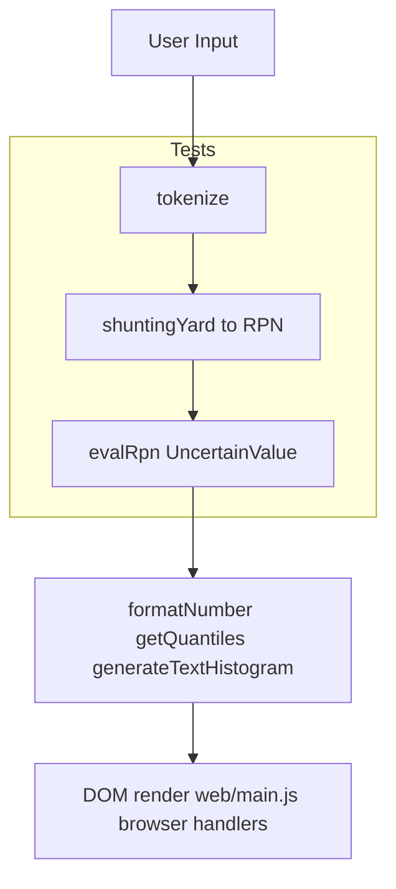

# unsure-calc

Lightweight probabilistic calculator that lets you type ranges (with `~`) and arithmetic to see exact bounds plus simulated outcomes and a text histogram.

Deployed at: https://calc.pythonic.ninja

## Getting started
1. Install prerequisites: `node` (v18+ for `node:test`) and `python3` for the simple dev server.
2. Run `make dev` then open `http://localhost:8000/web/` (override port with `DEV_PORT=9000 make dev`).
3. Run `make test` to execute the Node unit tests.

## Project structure (root)
- `core/calc-core.js` — single source of calculator logic used by web, Raycast, and tests.
- `core/tests/` — `node:test` suite covering tokenizer, unary minus, precedence, and range evaluation.
- `web/` — static site (Tailwind UI + browser controller).
- `raycast-extension/` — Raycast command code and manifest.
- `Makefile` — quick commands for local dev and tests.

## Makefile cheatsheet
- `make dev` — serve the app via `python3 -m http.server $(DEV_PORT)` (defaults to 8000).
- `make test` — run the Node test suite (`node --test core/tests`).

## Raycast extension
Lives in `raycast-extension/` and reuses `../core/calc-core.js` so everything stays in sync.

Files (under `raycast-extension/`)
- `package.json` — Raycast manifest (commands, prefs) plus npm deps; mirrors `raycast.json` for reference.
- `raycast.json` — same manifest data (kept for clarity).
- `src/calc.tsx` — Raycast command UI and thin re-export of the shared core for TypeScript.

Run it locally
1. Ensure Raycast is installed and its CLI is enabled (or that `npx ray` works).
2. `cd raycast-extension && npm install`
3. `npx ray develop`
4. Launch the command “UnSure Calculator” and type expressions like `7~10 * 17~23` or `(100~130)/(2~4)`.
